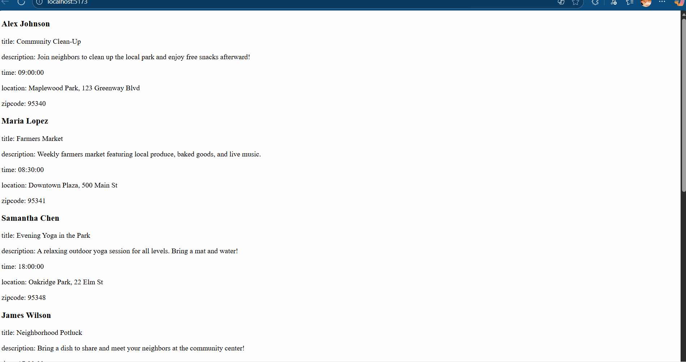

# Neighborhood Nook
**CodePath WEB103 Final Project**
**Designed and developed by:** Sebastian G and Aulissa B
**:link: Link to deployed app:** [Link will go here after deployment]
---
## About
### Description and Purpose
**Neighborhood Nook** is a hyperlocal community event board designed to connect neighbors by showcasing small-scale events happening right in their immediate area. Users can enter their zip code to discover local gatherings like garage sales, park meetups, block parties, or study groups. The core purpose is to foster real-world connections by not only listing events but also showing users which of their neighbors are planning to attend, making it easier to participate and build community ties.
### Inspiration
In an increasingly digital world, genuine local connections can sometimes feel harder to make. We were inspired by the simple idea of knowing what's happening just down the street and who you might meet there. Existing platforms often focus on large, city-wide events, missing the smaller, spontaneous gatherings that build tight-knit neighborhoods. Neighborhood Nook aims to bridge that gap, using technology to encourage face-to-face interaction and strengthen the fabric of local communities, one block party or park picnic at a time.
---
## Tech Stack
* **Frontend:** React (with TypeScript), Vite, React Router DOM, CSS
* **Backend:** Node.js, Express (with TypeScript), `tsx` (for development)
* **Database:** PostgreSQL (using the `pg` library)
---
## Features
*(Note: Checkboxes `[ ]` and GIFs will be added in later milestones as features are completed)*
**[ ✅ ] View Events by Neighborhood**
Users can enter their zip code to see a feed of upcoming events specific to their local area, sorted by date.
**[ ✅ ] View Event Details**
Clicking on an event card navigates the user to a dedicated page showing the full event description, location details, time, and the list of attendees.

**[ ✅ ] Create New Event (with Modal & Validation)**
Authenticated users can add a new event to their neighborhood via a modal pop-up form. Input is validated on the backend (e.g., event date must be in the future, title required).
*(Includes Custom Features: Modal Pop-up, Backend Validation)*
**[ ✅  ] Edit Own Event**
Users can edit the details of events they created. *(CRUD - Update)*
**[ ✅ ] Delete Own Event**
Users can delete events they created. *(CRUD - Delete)*

---
## Installation Instructions
[Instructions on how to clone, install dependencies (`npm install` in root, client, server), set up the `.env` file, and run the development servers will go here later]