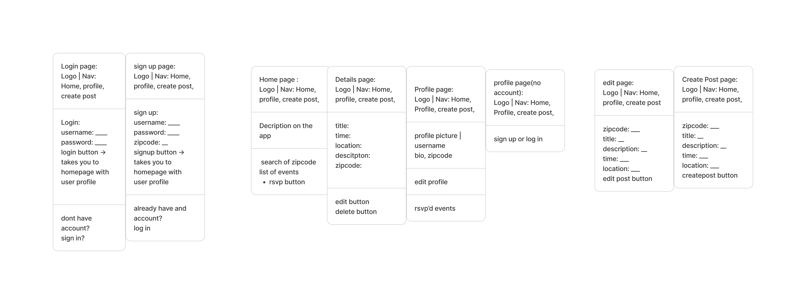

# Wireframes

Reference the Creating Wireframes final project guide in the course portal for more information about how to complete this deliverable.

---

## List of Pages

-  **Login Page**
-  **Sign Up Page**
-  **Home Page**
-  **Details Page**
-  **Profile Page**
-  **Profile (No Account) Page**
-  **Edit Event Page**
-  **Create Post Page**

---

## Wireframe Overview

The following wireframes show the layout and key elements of each page in the Neighborhood Events web app.  

---

### Page Details

#### 1. Login Page 
- Fields: **Username**, **Password**
- Buttons: **Login**, **Sign Up** (link for new users)
- Redirects to **Home Page** upon successful login

#### 2. Sign Up Page 
- Fields: **Username**, **Password**, **Zipcode**
- Buttons: **Sign Up**, **Log In**
- Redirects to **Home Page** after successful registration

#### 3. Home Page 
- Elements: app description, search bar (by zipcode)
- Shows a list of events with title, time, and RSVP option
- Navigation: Home, Profile, Create Post

#### 4. Details Page 
- Displays: **Title**, **Time**, **Location**, **Description**, **Zipcode**
- Buttons: **Edit**, **Delete** (visible only to the event creator)
- Option to **RSVP** or **Un-RSVP**

#### 5. Profile Page 
- Shows: profile picture, username, zipcode, and RSVP’d events
- Buttons: **Edit Profile**, **Log Out**

#### 6. Profile (No Account) Page 
- Message: “You must log in to view your profile.”
- Buttons: **Log In**, **Sign Up**
- Redirects user to the Login or Signup page

#### 7. Edit Event Page 
- Fields: **Zipcode**, **Title**, **Description**, **Time**, **Location**
- Button: **Update Event**
- Redirects to the event’s detail page after editing

#### 8. Create Post Page 
- Fields: **Zipcode**, **Title**, **Description**, **Time**, **Location**
- Button: **Create Event**
- Redirects to Home Page with new event listed

---

